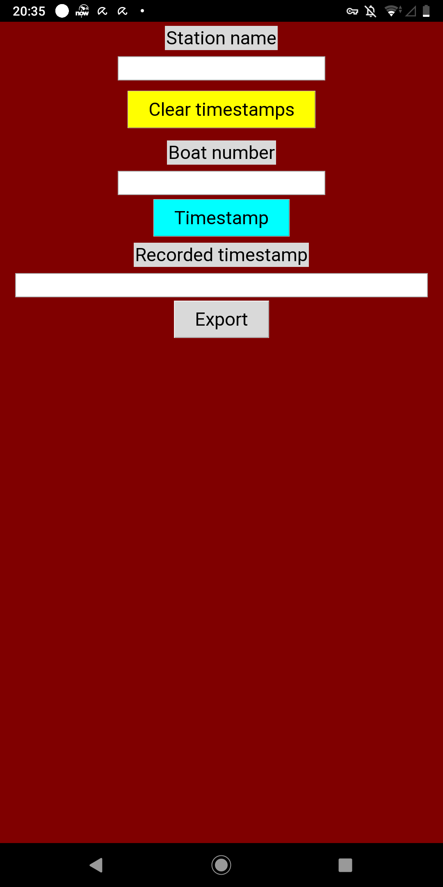
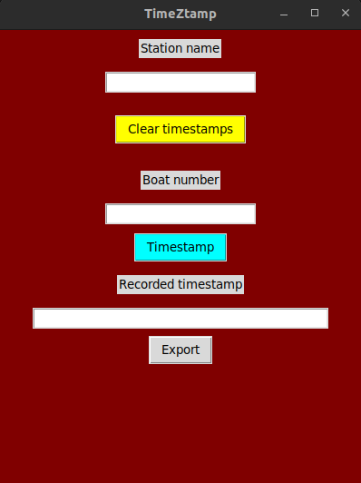

# TimeZtamp

This simple script can make timestamps when the button is clicked, and can export the recorded timestamps into a plain text (txt) file in the same location as the script.

## Requirements

- python3 (on computers)
- Pydroid 3 with storage permission (on android devices)

## Features

1. Three buttons: Clear (wipe recorded timestamps), Timestamp (recording one), and Export (put all recorded timestamps into a plain text file)
0. All text boxes, including the "Recorded timestamp" line, can be edited (in case a boat number is wrong when making the respective timestamp)

## Screenshots
### Android (in Pydroid 3)

### Ubuntu

